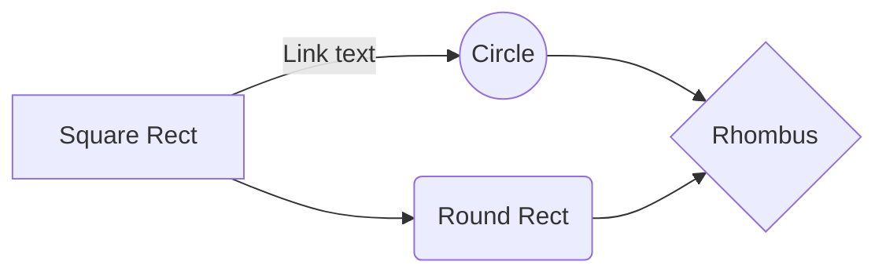

# 📋 Today I Learned

<!-- MarkdownTOC autolink="true" autoanchor="true" uri_encoding="false" -->

- [🤖 Android](#🤖-android)
    - [AAPT and GZ files](#aapt-and-gz-files)
    - [AutoCleanedValue](#autocleanedvalue)
    - [BottomSheetBehavior extensions](#bottomsheetbehavior-extensions)
    - [ConcatAdapter find global position](#concatadapter-find-global-position)
    - [Debuggable APK](#debuggable-apk)
    - [Disable Samsung VR](#disable-samsung-vr)
    - [Download all APK files](#download-all-apk-files)
    - [Edit SharePreferences](#edit-sharepreferences)
    - [Ellipsized TextView](#ellipsized-textview)
    - [Firebase Analytics debug](#firebase-analytics-debug)
    - [Kotlin Coroutines debug probes](#kotlin-coroutines-debug-probes)
    - [Lifecycle CheatSheets](#lifecycle-cheatsheets)
    - [List resources at runtime](#list-resources-at-runtime)
    - [LiveData Events](#livedata-events)
    - [LiveData unit testing](#livedata-unit-testing)
    - [Locate APK files](#locate-apk-files)
    - [Manually sign APK](#manually-sign-apk)
    - [Print APK certificates](#print-apk-certificates)
    - [Project view by default](#project-view-by-default)
    - [Resource identifier for MATCH_PARENT and WRAP_CONTENT](#resource-identifier-for-match_parent-and-wrap_content)
    - [Resources abstraction](#resources-abstraction)
    - [Run command as a specific application user-id](#run-command-as-a-specific-application-user-id)
    - [screencap](#screencap)
    - [scrcpy](#scrcpy)
    - [Tools sample resources as JSON files](#tools-sample-resources-as-json-files)
    - [ViewBinding extension](#viewbinding-extension)
    - [ViewBinding one-liner](#viewbinding-one-liner)
    - [ViewModel in custom View](#viewmodel-in-custom-view)
    - [WorkManager diagnostic](#workmanager-diagnostic)
- [🖥️ Bash](#🖥️-bash)
    - [Inline comment on multiline commands](#inline-comment-on-multiline-commands)
    - [Merge files together](#merge-files-together)
    - [Prefered Bash sheband](#prefered-bash-sheband)
    - [Prune find results](#prune-find-results)
- [🌍 Chrome](#🌍-chrome)
    - [Overlay Scrollbar](#overlay-scrollbar)
- [🗡️ Dagger](#🗡️-dagger)
    - [Binding extension functions](#binding-extension-functions)
    - [Coroutines provider](#coroutines-provider)
    - [Extensions for Lazy & Provider](#extensions-for-lazy--provider)
    - [Private dependencies](#private-dependencies)
- [🏢 Gerrit](#🏢-gerrit)
    - [Customized dashboard](#customized-dashboard)
    - [Gmail filters](#gmail-filters)
- [💽 Git](#💽-git)
    - [Alias to function](#alias-to-function)
    - [Authors with commit count](#authors-with-commit-count)
    - [Diffing with patience](#diffing-with-patience)
    - [Ignoring commits in the blame view](#ignoring-commits-in-the-blame-view)
    - [List objects by size](#list-objects-by-size)
    - [Print changes between two refs](#print-changes-between-two-refs)
    - [Rebase dependent branch](#rebase-dependent-branch)
    - [Recursive gc](#recursive-gc)
- [🐘 Gradle](#🐘-gradle)
    - [Cleanup caches and build directories](#cleanup-caches-and-build-directories)
    - [Default commit message](#default-commit-message)
    - [List project properties](#list-project-properties)
    - [Reproducible builds](#reproducible-builds)
    - [Upgrading the Gradle Wrapper](#upgrading-the-gradle-wrapper)
- [📦 IntelliJ IDEA](#📦-intellij-idea)
    - [Code formatting as a weak warning](#code-formatting-as-a-weak-warning)
    - [EditorConfig](#editorconfig)
    - [Plugins](#plugins)
    - [Project icon](#project-icon)
    - [Required plugins](#required-plugins)
    - [Shortcuts](#shortcuts)
- [🧪 JUnit](#🧪-junit)
    - [Flaky TestRule](#flaky-testrule)
    - [Locale TestRule](#locale-testrule)
    - [Repeat TestRule](#repeat-testrule)
    - [TimeZone TestRule](#timezone-testrule)
- [🧑‍💻 Kotlin](#🧑‍💻-kotlin)
    - [BitFlags](#bitflags)
    - [Check if a class is in the classpath](#check-if-a-class-is-in-the-classpath)
    - [Coroutine's CancellationException with runCatching](#coroutines-cancellationexception-with-runcatching)
    - [Filter non-null values in a Map](#filter-non-null-values-in-a-map)
    - [Implicit lamda result with run and let](#implicit-lamda-result-with-run-and-let)
    - [Invoke operator on Companion objects](#invoke-operator-on-companion-objects)
    - [Invoke operator on Coroutines Dispatchers](#invoke-operator-on-coroutines-dispatchers)
    - [Kotlin script](#kotlin-script)
    - [Language injection](#language-injection)
    - [LazyMutable](#lazymutable)
    - [MainCoroutineRule](#maincoroutinerule)
    - [MockK extension to wait indefinitely](#mockk-extension-to-wait-indefinitely)
    - [Property delegate to cancel previous Job](#property-delegate-to-cancel-previous-job)
    - [Read resource file](#read-resource-file)
    - [Recursive flatMap](#recursive-flatmap)
    - [Regex destructuring](#regex-destructuring)
    - [Require an instance type](#require-an-instance-type)
    - [Sealed object instances](#sealed-object-instances)
    - [SemVer](#semver)
    - [Singleton](#singleton)
    - [Synchronize a Map with a new Map of values](#synchronize-a-map-with-a-new-map-of-values)
    - [Timeout for async operations](#timeout-for-async-operations)
- [🍎 Mac](#🍎-mac)
    - [AltTab](#alttab)
    - [Karabiner](#karabiner)
    - [UnnaturalScrollWheels](#unnaturalscrollwheels)
- [📄 Markdown](#📄-markdown)
    - [Details summary](#details-summary)
    - [Diff](#diff)
    - [GeoJSON](#geojson)
    - [Keyboard](#keyboard)
    - [Maths](#maths)
    - [Mermaid](#mermaid)
    - [Prefers color scheme](#prefers-color-scheme)
    - [Table alignment](#table-alignment)
    - [Theme context for images](#theme-context-for-images)
- [🕸️ Online tools](#🕸️-online-tools)
- [🔓 Open Source projects](#🔓-open-source-projects)
- [🔀 Sublime Merge](#🔀-sublime-merge)
    - [Custom commands](#custom-commands)
- [🗃️ Sublime Text](#🗃️-sublime-text)
    - [Useful packages](#useful-packages)
- [🧰 Utils](#🧰-utils)
    - [Count lines of code](#count-lines-of-code)
    - [Create empty file with specific size](#create-empty-file-with-specific-size)
    - [Diff between two PNGs](#diff-between-two-pngs)
    - [mp4 to gif](#mp4-to-gif)
    - [NCurses Disk Usage](#ncurses-disk-usage)
    - [Web crawler](#web-crawler)
- [🪟 Windows](#🪟-windows)
    - [Reboot GPU driver](#reboot-gpu-driver)

<!-- /MarkdownTOC -->

<a id="🤖-android"></a>
## 🤖 Android

<a id="aapt-and-gz-files"></a>
### AAPT and GZ files

AAPT will silently decompress any `.gz` file from the `assets` directory.
If you store a (compressed) `/assets/data.json.gz` file, AAPT will only package a (decompressed) `/assets/data.json` file in the resulting apk and aab.

A workaround is to move the file in Java's resources folder `/resources/assets/data.json.gz`.

[🔗](https://cs.android.com/android/platform/superproject/+/master:frameworks/base/tools/aapt/Package.cpp;l=276-279;drc=18f16d6241c6398a034237c2a5343f94d1938f6a)

<a id="autocleanedvalue"></a>
### AutoCleanedValue

```kotlin
import androidx.fragment.app.Fragment
import androidx.lifecycle.DefaultLifecycleObserver
import androidx.lifecycle.Lifecycle.State.INITIALIZED
import androidx.lifecycle.LifecycleOwner
import androidx.lifecycle.Observer
import kotlin.properties.ReadWriteProperty
import kotlin.reflect.KProperty

class AutoCleanedValue<T : Any>(
    fragment: Fragment,
    private val initializer: (() -> T)?
) : ReadWriteProperty<Fragment, T> {

    private var _value: T? = null

    init {
        fragment.lifecycle.addObserver(object : DefaultLifecycleObserver {
            val viewLifecycleOwnerObserver = Observer<LifecycleOwner> {
                it?.lifecycle?.addObserver(object : DefaultLifecycleObserver {
                    override fun onDestroy(owner: LifecycleOwner) {
                        _value = null
                    }
                })
            }

            override fun onCreate(owner: LifecycleOwner) =
                fragment.viewLifecycleOwnerLiveData.observeForever(viewLifecycleOwnerObserver)

            override fun onDestroy(owner: LifecycleOwner) =
                fragment.viewLifecycleOwnerLiveData.removeObserver(viewLifecycleOwnerObserver)
        })
    }

    override fun getValue(thisRef: Fragment, property: KProperty<*>): T = _value ?: run {
        if (!thisRef.viewLifecycleOwner.lifecycle.currentState.isAtLeast(INITIALIZED)) throw IllegalStateException("Fragment might have been destroyed or is not initialized yet!")
        if (initializer == null) throw IllegalStateException("No default initializer provided!")
        initializer.invoke().also { _value = it }
    }

    override fun setValue(thisRef: Fragment, property: KProperty<*>, value: T) {
        _value = value
    }
}

fun <T : Any> Fragment.autoCleaned(
    initializer: (() -> T)? = null
): AutoCleanedValue<T> = AutoCleanedValue(this, initializer)
```

```kotlin
class MyFragment : Fragment() {

    private val adapter: MyAdapter by autoCleaned(::MyAdapter)
    private var binding: MyBinding by autoCleaned()

    override fun onCreateView(
        inflater: LayoutInflater,
        container: ViewGroup?,
        savedInstanceState: Bundle?
    ): View = MyBinding.inflate(inflater, container, false).also { binding = it }.root

}
```

[🔗](https://www.scalereal.com/android/2021/03/12/let-your-delegates-auto-nullify-references.html) [🔗](https://itnext.io/an-update-to-the-fragmentviewbindingdelegate-the-bug-weve-inherited-from-autoclearedvalue-7fc0a89fcae1)

<a id="bottomsheetbehavior-extensions"></a>
### BottomSheetBehavior extensions

```kotlin
fun <V : View> V.behavior(): BottomSheetBehavior<V> = BottomSheetBehavior.from(this)

fun BottomSheetBehavior<*>.isExpanded(): Boolean = state == STATE_EXPANDED
fun BottomSheetBehavior<*>.isHalfExpanded(): Boolean = state == STATE_HALF_EXPANDED
fun BottomSheetBehavior<*>.isCollapsed(): Boolean = state == STATE_COLLAPSED
fun BottomSheetBehavior<*>.isHidden(): Boolean = state == STATE_HIDDEN
fun BottomSheetBehavior<*>.isDragging(): Boolean = state == STATE_DRAGGING
fun BottomSheetBehavior<*>.isSettling(): Boolean = state == STATE_SETTLING

fun BottomSheetBehavior<*>.collapse() { state = STATE_COLLAPSED }
fun BottomSheetBehavior<*>.expand() { state = STATE_EXPANDED }
fun BottomSheetBehavior<*>.halfExpand() { state = STATE_HALF_EXPANDED }
fun BottomSheetBehavior<*>.hide() { state = STATE_HIDDEN }

fun BottomSheetBehavior<*>.toggle() { if (isExpanded()) collapse() else expand() }

/**
 * @param onBottomSheetStateChanged [BottomSheetCallback.onStateChanged]
 */
fun BottomSheetBehavior<*>.addBottomSheetStateChangedCallback(onBottomSheetStateChanged: (bottomSheet: View, newState: Int) -> Unit): BottomSheetCallback = object : BottomSheetCallback() {
    override fun onStateChanged(bottomSheet: View, @BottomSheetBehavior.State newState: Int) = onBottomSheetStateChanged(bottomSheet, newState)
    override fun onSlide(bottomSheet: View, slideOffset: Float) = Unit
}.also(this::addBottomSheetCallback)

/**
 * @param onBottomSheetSlide [BottomSheetCallback.onSlide]
 */
fun BottomSheetBehavior<*>.addBottomSheetSlideCallback(onBottomSheetSlide: (bottomSheet: View, slideOffset: Float) -> Unit): BottomSheetCallback = object : BottomSheetCallback() {
    override fun onStateChanged(bottomSheet: View, @BottomSheetBehavior.State newState: Int) = Unit
    override fun onSlide(bottomSheet: View, slideOffset: Float) = onBottomSheetSlide(bottomSheet, slideOffset)
}.also(this::addBottomSheetCallback)
```

<a id="concatadapter-find-global-position"></a>
### ConcatAdapter find global position

```kotlin
/**
 * @return the (global) position for the (local) [position] of the [adapter], or [NO_POSITION] if the [adapter] is not part of [this].
 */
fun ConcatAdapter.findPositionOf(
    position: Int,
    adapter: Adapter<*>,
): Int {
    var offset = 0
    adapters.forEach {
        if (it == adapter) return offset + position
        offset += it.itemCount
    }
    return NO_POSITION
}
```

<a id="debuggable-apk"></a>
### Debuggable APK

```bash
aapt dump badging <path-to-apk> | grep -c application-debuggable
```

<a id="disable-samsung-vr"></a>
### Disable Samsung VR

```bash
adb shell pm hide com.samsung.android.hmt.vrsvc
```

<a id="download-all-apk-files"></a>
### Download all APK files

```bash
for package in $(adb shell pm list packages -3 | tr -d '\r' | sed 's/package://g'); do apk=$(adb shell pm path $package | tr -d '\r' | sed 's/package://g'); echo "Pulling $apk"; adb pull -p $apk "$package".apk; done
```

<a id="edit-sharepreferences"></a>
### Edit SharePreferences

```bash
~ adb shell am force-stop <packageName>
~ adb shell run-as <packageName>
$ ls shared_prefs
$ cat shared_prefs/<fileName>.xml
$ echo '<?xml version="1.0" encoding="utf-8" standalone="yes" ?>
<map>
    <!-- Prefs here -->
</map>
' > shared_prefs/<fileName>.xml
```

or

```bash
cat > shared_prefs/<fileName>.xml
<?xml version='1.0' encoding='utf-8' standalone='yes' ?>
<map>
    <!-- Prefs here -->
</map>
Ctrl+C
```

<a id="ellipsized-textview"></a>
### Ellipsized TextView

```kotlin
fun TextView.isEllipsized(): Boolean = layout?.let { !TextUtils.equals(text, it.text) } ?: false
```

<a id="firebase-analytics-debug"></a>
### Firebase Analytics debug

[🔗](https://firebase.google.com/docs/analytics/debugview#enabling_debug_mode) Enabling debug mode forces the app to send events immediately instead of waiting for batches.

```bash
# Enable
adb shell setprop debug.firebase.analytics.app my.package.name
# Disable
adb shell setprop debug.firebase.analytics.app .none.
```

[🔗](https://developers.google.com/analytics/devguides/collection/ga4/send-events?technology=android#view_events_in_the_android_studio_debug_log) To enable Firebase logs in logcat:

```bash
adb shell setprop log.tag.FA VERBOSE
adb shell setprop log.tag.FA-SVC VERBOSE
adb logcat -v time -s FA FA-SVC
```

<a id="kotlin-coroutines-debug-probes"></a>
### Kotlin Coroutines debug probes

> The `kotlinx-coroutines-core` artifact contains a resource file that is not required for the coroutines to operate normally and is only used by the debugger.

```kotlin
android {
    packagingOptions {
        resources.excludes += "DebugProbesKt.bin"
    }
}
```

[🔗](https://github.com/Kotlin/kotlinx.coroutines#avoiding-including-the-debug-infrastructure-in-the-resulting-apk)

<a id="lifecycle-cheatsheets"></a>
### Lifecycle CheatSheets

[🔗 JoseAlcerreca/android-lifecycles](https://github.com/JoseAlcerreca/android-lifecycles)

<a id="list-resources-at-runtime"></a>
### List resources at runtime

```kotlin
/* Colors */
R.color::class.java.fields.forEach {
    val name = it.name
    val colorRes /*@ColorRes*/ = it.getInt(null)
    val colorInt /*@ColorInt*/ = ContextCompat.getColor(this, colorRes)
}

/* Drawables */
R.drawable::class.java.fields.forEach {
    val name = it.name
    val drawableRes /*@DrawableRes*/ = it.getInt(null)
    val drawable = ContextCompat.getDrawable(this, drawableRes)
}

/* Strings */
R.string::class.java.fields.forEach {
    val name = it.name
    val stringRes /*@StringRes*/ = it.getInt(null)
    val string = getString(stringRes)
}
```

<a id="livedata-events"></a>
### LiveData Events

Previously known as `SingleLiveEvent` [🔗](https://medium.com/androiddevelopers/livedata-with-snackbar-navigation-and-other-events-the-singleliveevent-case-ac2622673150)

```kotlin
/**
 * Used as a wrapper for data that is exposed via a LiveData that represents an event.
 */
open class Event<out T : Any>(private val content: T) {

    var hasBeenHandled = false
        private set

    /**
     * Returns the [content], even if it's already been handled.
     */
    fun peek(): T = content

    /**
     * Returns the [content] and prevents its use again.
     */
    fun getIfNotHandled(): T? = if (hasBeenHandled) null else content.also { hasBeenHandled = true }

    /**
     * Executes the [block] if the [content] has not already been handled.
     */
    fun ifNotHandled(block: (T) -> Unit) = getIfNotHandled()?.let(block)

}
```

[🔗](https://github.com/android/architecture-samples/blob/todo-mvvm-live-kotlin/todoapp/app/src/main/java/com/example/android/architecture/blueprints/todoapp/Event.kt)

```kotlin
/**
 * An [Observer] for [Event]s, simplifying the pattern of checking if the [Event]'s value has already been handled.
 *
 * [onEvent] is *only* called if the [Event]'s contents has not been handled.
 */
class EventObserver<T : Any>(
    private val onEvent: (T) -> Unit,
) : Observer<Event<T>> {
    override fun onChanged(event: Event<T>) {
        event.ifNotHandled(onEvent)
    }
}

fun <T : Any> LiveData<Event<T>>.observeEvent(
    owner: LifecycleOwner,
    onEvent: (T) -> Unit,
) = observe(owner, EventObserver(onEvent))
```

[🔗](https://gist.github.com/JoseAlcerreca/e0bba240d9b3cffa258777f12e5c0ae9)

<a id="livedata-unit-testing"></a>
### LiveData unit testing

```kotlin
/**
 * Gets the value of a [LiveData] or waits for it to have one, with a timeout.
 *
 * Use this extension from host-side (JVM) tests. It's recommended to use it alongside
 * `InstantTaskExecutorRule` or a similar mechanism to execute tasks synchronously.
 */
fun <T> LiveData<T>.awaitValue(
    duration: Duration = 2.seconds,
    afterObserve: () -> Unit = {}
): T {
    var data: T? = null
    val latch = CountDownLatch(1)
    val observer = object : Observer<T> {
        override fun onChanged(o: T?) {
            data = o
            latch.countDown()
            removeObserver(this)
        }
    }
    observeForever(observer)
    afterObserve.invoke()
    if (!latch.await(duration.inWholeMilliseconds, MILLISECONDS)) {
        removeObserver(observer)
        throw TimeoutException("LiveData value was never set.")
    }
    @Suppress("UNCHECKED_CAST")
    return data as T
}

/**
 * Observes a [LiveData] until the `block` is done executing.
 */
suspend fun <T> LiveData<T>.test(block: suspend () -> Unit) {
    val observer = Observer<T> { }
    try {
        observeForever(observer)
        block()
    } finally {
        removeObserver(observer)
    }
}
```

[🔗](https://medium.com/androiddevelopers/unit-testing-livedata-and-other-common-observability-problems-bb477262eb04)

<a id="locate-apk-files"></a>
### Locate APK files

```bash
adb shell pm list packages -f
adb shell pm path <package-name>
```

<a id="manually-sign-apk"></a>
### Manually sign APK

```bash
apksigner sign --ks debug.keystore --key-pass pass:android --ks-key-alias androiddebugkey --ks-pass pass:android app-release.apk
```

<a id="print-apk-certificates"></a>
### Print APK certificates

```bash
find . -name '*.apk' -type f -exec echo "APK: {}" \; -exec keytool -printcert -jarfile "{}" \;
```

<a id="project-view-by-default"></a>
### Project view by default

`Help` → `Edit Custom Properties` → `studio.projectview=true`

<a id="resource-identifier-for-match_parent-and-wrap_content"></a>
### Resource identifier for MATCH_PARENT and WRAP_CONTENT 

```xml
<resources xmlns:tools="http://schemas.android.com/tools">
    <!-- ViewGroup.LayoutParams.MATCH_PARENT -->
    <item name="match_parent" type="dimen" format="integer" tools:ignore="ResourceName">-1</item>
    <!-- ViewGroup.LayoutParams.WRAP_CONTENT -->
    <item name="wrap_content" type="dimen" format="integer" tools:ignore="ResourceName">-2</item>
</resources>
```

<a id="resources-abstraction"></a>
### Resources abstraction

-   <details>
        <summary><code>BooleanResource</code></summary>

    ```kotlin
    import android.content.res.Resources
    import androidx.annotation.BoolRes

    sealed class BooleanResource {
        companion object {
            fun from(boolean: Boolean): BooleanResource = BooleanValueResource(boolean)
            fun fromColorId(@BoolRes id: Int): BooleanResource = BooleanIdResource(id)
        }
    }

    private data class BooleanValueResource(val value: Boolean) : BooleanResource()
    private data class BooleanIdResource(@BoolRes val id: Int) : BooleanResource()

    fun BooleanResource.toBoolean(resources: Resources): Boolean = when (this) {
        is BooleanValueResource -> value
        is BooleanIdResource -> resources.getBoolean(id)
    }
    ```
    </details>

-   <details>
        <summary><code>ColorResource</code></summary>

    ```kotlin
    import android.content.res.ColorStateList
    import android.content.res.Resources
    import android.graphics.Color
    import androidx.annotation.ColorInt
    import androidx.annotation.ColorRes
    import androidx.core.content.res.ResourcesCompat

    sealed class ColorResource {
        companion object {
            fun from(color: String): ColorResource = ColorStringResource(color)
            fun fromColorId(@ColorRes id: Int): ColorResource = ColorIdResource(id)
        }
    }

    private data class ColorStringResource(val value: String) : ColorResource()
    private data class ColorIdResource(@ColorRes val id: Int) : ColorResource()

    @ColorInt
    fun ColorResource.toColorInt(resources: Resources, theme: Resources.Theme? = null): Int = when (this) {
        is ColorStringResource -> Color.parseColor(value)
        is ColorIdResource -> ResourcesCompat.getColor(resources, id, theme)
    }

    fun ColorResource.toColorStateList(resources: Resources, theme: Resources.Theme? = null): ColorStateList? = when (this) {
        is ColorStringResource -> ColorStateList.valueOf(toColorInt(resources))
        is ColorIdResource -> ResourcesCompat.getColorStateList(resources, id, theme)
    }
    ```
    </details>

-   <details>
        <summary><code>DrawableResource</code></summary>

    ```kotlin
    import android.content.res.Resources
    import android.graphics.Bitmap
    import android.graphics.drawable.Drawable
    import androidx.annotation.DrawableRes
    import androidx.core.content.res.ResourcesCompat
    import androidx.core.graphics.drawable.toDrawable

    sealed class DrawableResource {
        companion object {
            fun from(drawable: Drawable): DrawableResource = DrawableValueResource(drawable)
            fun fromBitmap(bitmap: Bitmap): DrawableResource = DrawableBitmapResource(bitmap)
            fun fromDrawableId(@DrawableRes id: Int): DrawableResource = DrawableIdResource(id)
        }
    }

    private data class DrawableValueResource(val drawable: Drawable) : DrawableResource()
    private data class DrawableBitmapResource(val bitmap: Bitmap) : DrawableResource()
    private data class DrawableIdResource(@DrawableRes val id: Int) : DrawableResource()

    fun DrawableResource.toDrawable(resources: Resources, theme: Resources.Theme? = null): Drawable? = when (this) {
        is DrawableValueResource -> drawable
        is DrawableBitmapResource -> bitmap.toDrawable(resources)
        is DrawableIdResource -> ResourcesCompat.getDrawable(resources, id, theme)
    }
    ```
    </details>

-   <details>
        <summary><code>TextResource</code></summary>

    ```kotlin
    import android.content.res.Resources
    import androidx.annotation.PluralsRes
    import androidx.annotation.StringRes
    import java.text.MessageFormat

    sealed class TextResource {
        companion object {
            fun none(): TextResource = NullTextResource
            fun fromString(text: CharSequence): TextResource = StringTextResource(text)
            fun fromStringId(@StringRes id: Int, vararg args: Any = emptyArray()): TextResource = StringIdTextResource(id, args.toList())
            fun fromPluralId(@PluralsRes id: Int, quantity: Int, vararg args: Any = emptyArray()): TextResource = PluralIdTextResource(id, quantity, args.toList())
            fun fromMessage(@StringRes id: Int, vararg args: Any = emptyArray()): TextResource = MessageIdTextResource(id, args.toList())
        }

        @Deprecated(
                message = "Suspicious toString() usage, please use toString(resources) if you need to resolve the TextResource.",
                replaceWith = ReplaceWith("toString(resources)"),
                level = DeprecationLevel.WARNING
        )
        override fun toString(): String = super.toString()

    }

    private object NullTextResource : TextResource()
    private data class StringTextResource(val text: CharSequence) : TextResource()
    private data class StringIdTextResource(@StringRes val id: Int, val args: List<Any>) : TextResource()
    private data class PluralIdTextResource(@PluralsRes val id: Int, val quantity: Int, val args: List<Any>) : TextResource()
    private data class MessageIdTextResource(@StringRes val id: Int, val args: List<Any>) : TextResource()

    fun TextResource?.orNone(): TextResource = this ?: TextResource.none()

    fun TextResource.toText(resources: Resources): CharSequence? = when (this) {
        NullTextResource -> null
        is StringTextResource -> text
        is StringIdTextResource -> if (args.isEmpty()) resources.getText(id) else toString(resources)
        is PluralIdTextResource -> if (args.isEmpty()) resources.getQuantityText(id, quantity) else toString(resources)
        is MessageIdTextResource -> if (args.isEmpty()) MessageFormat.format(resources.getString(id)) else toString(resources)
    }

    fun TextResource.toString(resources: Resources): String? = when (this) {
        NullTextResource -> null
        is StringTextResource -> text.toString()
        is StringIdTextResource -> if (args.isEmpty()) resources.getString(id) else resources.getString(id, *args.mapTextResourceToString(resources))
        is PluralIdTextResource -> if (args.isEmpty()) resources.getQuantityString(id, quantity) else resources.getQuantityString(id, quantity, *args.mapTextResourceToString(resources))
        is MessageIdTextResource -> if (args.isEmpty()) MessageFormat.format(resources.getString(id)) else MessageFormat.format(resources.getString(id), *args.mapTextResourceToString(resources))
    }

    private fun <E> List<E>.mapTextResourceToString(resources: Resources) = map { if (it is TextResource) it.toString(resources) else it }.toTypedArray()
    ```
    </details>

<a id="run-command-as-a-specific-application-user-id"></a>
### Run command as a specific application user-id

```bash
adb shell run-as <package-name> <command> [<args>]
```

<a id="screencap"></a>
### screencap

```bash
adb shell screencap -p "/sdcard/screencap.png" && adb pull "/sdcard/screencap.png" "$USER/Desktop/%time::=-%%random%.png" && adb shell rm "/sdcard/screencap.png"
```

```pwsh
%comspec% /c adb shell screencap -p "/sdcard/screencap.png" && adb pull "/sdcard/screencap.png" "%UserProfile%\Desktop\%time::=-%%random%.png" && adb shell rm "/sdcard/screencap.png"
```

<a id="scrcpy"></a>
### scrcpy

[GitHub](https://github.com/Genymobile/scrcpy)

- record
    ```bash
    scrcpy -m 1080 --show-touches --no-display --record "$USER/Desktop/%time::=-%%random%.mp4"
    ```

    ```pwsh
    %comspec% /c scrcpy -m 1080 --show-touches --no-display --record "%UserProfile%\Desktop\%time::=-%%random%.mp4"
    ```
- mirror
    ```bash
    scrcpy -m 1080 --show-touches
    ```

    ```pwsh
    %comspec% /c scrcpy -m 1080 --show-touches
    ```

<a id="tools-sample-resources-as-json-files"></a>
### Tools sample resources as JSON files

```json
/* ./sampledata/users.json */
{
    "data": [
        {
            "name": "Mike Barrett",
            "address": "4898 Locust Rd",
            "avatar": "@sample/avatars"
        },
        {
            "name": "Kylie Long",
            "address": "2659 Taylor St",
            "avatar": "@sample/avatars"
        }
    ]
}
```

```xml
<ImageView
    android:id="@+id/avatar"
    tools:src="@sample/users.json/data/avatar" />
 
<TextView
    android:id="@+id/name"
    tools:text="@sample/users.json/data/name" />
 
  <TextView
    android:id="@+id/address"
    tools:text="@sample/users.json/data/address" />
```

[🔗 `@tools:sample/*`](https://developer.android.com/studio/write/tool-attributes#toolssample_resources)

<a id="viewbinding-extension"></a>
### ViewBinding extension

```kotlin
fun <Binding : ViewBinding> AppCompatActivity.setContentView(
    inflate: (LayoutInflater) -> Binding
): Binding = inflate(layoutInflater).also {
    setContentView(it.root)
}
```

```kotlin
private lateinit var binding: MainViewBinding

override fun onCreate(savedInstanceState: Bundle?) {
    super.onCreate(savedInstanceState)
    binding = setContentView(MainViewBinding::inflate)
}
```

<a id="viewbinding-one-liner"></a>
### ViewBinding one-liner

```kotlin
private lateinit var binding: MainViewBinding

override fun onCreate(savedInstanceState: Bundle?) {
    super.onCreate(savedInstanceState)
    setContentView(MainViewBinding.inflate(layoutInflater).also { binding = it }.root)
}
```

<a id="viewmodel-in-custom-view"></a>
### ViewModel in custom View

```kotlin
class CustomView @JvmOverloads constructor(context: Context, attrs: AttributeSet? = null, defStyleAttr: Int = 0) : View(context, attrs, defStyleAttr) {

  private val viewModel by lazy { ViewModelProvider(findViewTreeViewModelStoreOwner()!!).get<CustomViewModel>() }

  override fun onAttachedToWindow() {
    super.onAttachedToWindow()
    viewModel.state.observe(findViewTreeLifecycleOwner()!!) { TODO() }
  }

}
```

<a id="workmanager-diagnostic"></a>
### WorkManager diagnostic 

[🔗](https://developer.android.com/topic/libraries/architecture/workmanager/how-to/debugging#request-diagnostic-information-from-workmanager-2.4.0) This provides information on:
- Work requests that were completed in the last 24 hours.
- Work requests that are currently running.
- Scheduled work requests.

```bash
adb shell am broadcast -a "androidx.work.diagnostics.REQUEST_DIAGNOSTICS" -p my.package.name
```

<a id="🖥️-bash"></a>
## 🖥️ Bash

<a id="inline-comment-on-multiline-commands"></a>
### Inline comment on multiline commands

```bash
cmd1 `# This is a comment` \
  cmd2 # This is another comment
```

<a id="merge-files-together"></a>
### Merge files together

```bash
time {
    echo "↓↓↓"
    find . -type f -name "*.txt" -print0 | xargs -0 cat
    echo "↑↑↑"
} > merged.log
```

<a id="prefered-bash-sheband"></a>
### Prefered Bash sheband

```bash
#!/usr/bin/env bash
```

[🔗](https://stackoverflow.com/a/10383546/3615879)

<a id="prune-find-results"></a>
### Prune find results

```bash
find . -path "*/build" -prune -o -name "*.kt" -print
```

<a id="🌍-chrome"></a>
## 🌍 Chrome

<a id="overlay-scrollbar"></a>
### Overlay Scrollbar

```bash
"...\chrome.exe" --enable-features=OverlayScrollbar,OverlayScrollbarFlashAfterAnyScrollUpdate,OverlayScrollbarFlashWhenMouseEnter
```

<a id="🗡️-dagger"></a>
## 🗡️ Dagger

<a id="binding-extension-functions"></a>
### Binding extension functions

```kotlin
@Module
abstract class RepositoryModule {

    @Binds
    abstract fun RepositoryImpl.bind(): Repository

    @Binds
    abstract fun @receiver:MyQualifier RepositoryImpl.bind(): Repository

}
```

```kotlin
@Module
interface RepositoryModule {

    @get:Binds
    val RepositoryImpl.bind: Repository

}
```

[🔗](https://www.zacsweers.dev/dagger-party-tricks-extension-functions/)

<a id="coroutines-provider"></a>
### Coroutines provider

```kotlin
@Qualifier annotation class MainDispatcher
@Qualifier annotation class MainImmediateDispatcher
@Qualifier annotation class DefaultDispatcher
@Qualifier annotation class IoDispatcher
@Qualifier annotation class UnconfinedDispatcher


@Module @InstallIn(SingletonComponent::class)
object CoroutinesModule {

    @Provides @MainDispatcher
    fun main(): CoroutineDispatcher = Main

    @Provides @MainImmediateDispatcher
    fun mainImmediate(): CoroutineDispatcher = Main.immediate

    @Provides @DefaultDispatcher
    fun default(): CoroutineDispatcher = Default

    @Provides @IoDispatcher
    fun io(): CoroutineDispatcher = IO

    @Provides @UnconfinedDispatcher
    fun unconfined(): CoroutineDispatcher = Unconfined

    @Provides
    fun provider(): CoroutineDispatcherProvider = object : CoroutineDispatcherProvider {}

}

interface CoroutineDispatcherProvider {
    fun main(): CoroutineDispatcher = Main
    fun immediate(): CoroutineDispatcher = Main.immediate
    fun default(): CoroutineDispatcher = Default
    fun io(): CoroutineDispatcher = IO
    fun unconfined(): CoroutineDispatcher = Unconfined
}
```

<a id="extensions-for-lazy--provider"></a>
### Extensions for Lazy & Provider

```kotlin
import kotlin.reflect.KProperty

operator fun <T> Provider<T>.getValue(thisRef: Any?, property: KProperty<*>): T = get()
operator fun <T> dagger.Lazy<T>.getValue(thisRef: Any?, property: KProperty<*>): T = get()


class Repository @Inject constructor(
    api: dagger.Lazy<Api>,
) {
    private val api by api
}
```

<a id="private-dependencies"></a>
### Private dependencies

```kotlin
@Qualifier private annotation class InternalApi

@Module
object NetworkModule {

    @Provides @InternalApi 
    fun provideClient(): OkHttpClient = ...

    @Provides
    fun provideRetrofit(@InternalApi client: Lazy<OkHttpClient>): Retrofit = ...

}
```

[🔗](https://www.zacsweers.dev/dagger-party-tricks-private-dependencies/)

<a id="🏢-gerrit"></a>
## 🏢 Gerrit

<a id="customized-dashboard"></a>
### Customized dashboard

```
/dashboard/?title=👨%E2%80%8D💻My+Dashboard&🔔=status:open+(ownerin:my-group+OR+project:my-project)+hashtag:prio&📄=has:draft&🧪=is:open+owner:self+is:wip&📧=is:open+-is:ignored+cc:self&📤=is:open+owner:self+-is:wip+-is:ignored&📥=is:open+(ownerin:my-group+OR+project:my-project)+-owner:self+-is:wip+-is:ignored+-label:Code-Review=2+(reviewer:self+OR+assignee:self)+limit:50
```

<a id="gmail-filters"></a>
### Gmail filters

`from:(review@domain.tld) -{("Gerrit-Owner: Simon MARQUIS" "Gerrit-HasComments: Yes") "Gerrit-Comment-In-Reply-To: Simon MARQUIS" ("Gerrit-MessageType: setassignee" "Gerrit-Assignee: Simon MARQUIS")}`

<a id="💽-git"></a>
## 💽 Git

<a id="alias-to-function"></a>
### Alias to function

```bash
# ~/.gitconfig
[alias]
    hello = "!f() { echo \"Hello, ${1:-World}!\" ; }; f"
```

<a id="authors-with-commit-count"></a>
### Authors with commit count

```bash
# ~/.gitconfig
[alias]
    authors = "!git log --pretty=format:%aN | sort | uniq -c | sort -rn"
```

<a id="diffing-with-patience"></a>
### Diffing with patience

```bash 
# ~/.gitconfig
[diff]
    # git config --global diff.algorithm patience
    algorithm = patience
```

<a id="ignoring-commits-in-the-blame-view"></a>
### Ignoring commits in the blame view

```bash
# .git-blame-ignore-revs

# Reformat code
44e8ca9a329dbb7a673b55cd25fbe982f10572fa
# Add newline at end of files
2f5f618ff431f87687e7446f0980849a88d01d9a
```

- Manually
    ```bash
    git blame --ignore-revs-file .git-blame-ignore-revs <file>
    ```
- Automatically
    ```bash
    # Ignore revisions listed in the file, one unabbreviated object name per line.
    git config --global blame.ignoreRevsFile .git-blame-ignore-revs
    # Mark any lines that have had a commit skipped using --ignore-rev with a `?`
    git config --global blame.markIgnoredLines true
    # Mark any lines that were added in a skipped commit and can not be attributed with a `*`
    git config --global blame.markUnblamableLines true
    ```

[🔗](https://docs.github.com/en/repositories/working-with-files/using-files/viewing-a-file#ignore-commits-in-the-blame-view)

<a id="list-objects-by-size"></a>
### List objects by size

```bash
git rev-list --objects --all |
  git cat-file --batch-check='%(objecttype) %(objectname) %(objectsize) %(rest)' |
  sed -n 's/^blob //p' |
  sort --numeric-sort --key=2 |
  cut -c 1-12,41- |
  $(command -v gnumfmt || echo numfmt) --field=2 --to=iec-i --suffix=B --padding=7 --round=nearest
```

[🔗](https://stackoverflow.com/a/42544963/3615879)

<a id="print-changes-between-two-refs"></a>
### Print changes between two refs

```bash
git log --topo-order --pretty=format:"%h ~ %s" $1..$2 --no-merges
```

<a id="rebase-dependent-branch"></a>
### Rebase dependent branch

```bash
# git rebase --onto <what-branch> <from-exclusive>@{1} <up-to-inclusive>
git rebase --onto featureA featureA@{1} featureB
```

<a id="recursive-gc"></a>
### Recursive gc

```bash
find . -name '*.git' -execdir sh -c 'cd {} && git gc' \;
```

<a id="🐘-gradle"></a>
## 🐘 Gradle

<a id="cleanup-caches-and-build-directories"></a>
### Cleanup caches and build directories

```bash
# Gradle cache
rm -rf ~/.gradle/caches

# Gradle build dirs
find . -type d -name "build" -prune -exec echo '{}' \; -exec rm -r '{}' \;
```

<a id="default-commit-message"></a>
### Default commit message

```bash
git config --global commit.template ~/.gitmessage
```

<a id="list-project-properties"></a>
### List project properties

```bash
gradlew properties

# To get a specific property
gradlew -q properties --console=plain | grep "^<my-property>:" | awk '{printf $2}'

# Or on newer versions
gradlew -q properties --property=<my-property>
```

<a id="reproducible-builds"></a>
### Reproducible builds

```kotlin
/* build.gradle.kts */
tasks.withType<AbstractArchiveTask>().configureEach {
    isPreserveFileTimestamps = false
    isReproducibleFileOrder = true
}
```

[🔗](https://docs.gradle.org/current/userguide/working_with_files.html#sec:reproducible_archives)

<a id="upgrading-the-gradle-wrapper"></a>
### Upgrading the Gradle Wrapper

```bash
# Update the version in gradle/wrapper/gradle-wrapper.properties
./gradlew wrapper --gradle-version x.y.z --distribution-type bin
# Update the in gradle-wrapper.jar
./gradlew wrapper
# Validate the version
./gradlew --version
```

[🔗](https://docs.gradle.org/current/userguide/gradle_wrapper.html#sec:upgrading_wrapper)

<a id="📦-intellij-idea"></a>
## 📦 IntelliJ IDEA

<a id="code-formatting-as-a-weak-warning"></a>
### Code formatting as a weak warning
 
`File` → `Settings` → `Editor` → `Inspections` → `File is not formatted according to project settings`

[🔗](https://twitter.com/kotlin/status/1067825173196414976)

<a id="editorconfig"></a>
### EditorConfig

```config
root = true

[*]
charset = utf-8
indent_size = 4
indent_style = space
insert_final_newline = false
max_line_length = 200
tab_width = 4

[{*.kt,*.kts}]
ij_kotlin_code_style_defaults = KOTLIN_OFFICIAL
ij_kotlin_allow_trailing_comma = true
ij_kotlin_allow_trailing_comma_on_call_site = true
```

[🔗](https://www.jetbrains.com/help/idea/editorconfig.html) [🔗](https://www.jetbrains.com/help/idea/editorconfig.html)

<a id="plugins"></a>
### Plugins

- [ADB Idea](https://plugins.jetbrains.com/plugin/7380-adb-idea)
- [Atom Material Icons](https://plugins.jetbrains.com/plugin/10044-atom-material-icons)
- [XWin Keymap](https://plugins.jetbrains.com/plugin/13094-xwin-keymap)

<a id="project-icon"></a>
### Project icon

```gitignore
!.idea/icon.png
!.idea/icon_dark.png
```

<a id="required-plugins"></a>
### Required plugins

<kbd>Ctrl</kbd> + <kbd>Alt</kbd> + <kbd>S</kbd> \| Build, Execution, Deployment \| Required Plugins.

```xml
<!-- .idea/externalDependencies.xml -->
<?xml version="1.0" encoding="UTF-8"?>
<project version="4">
  <component name="ExternalDependencies">
    <plugin id="org.editorconfig.editorconfigjetbrains" />
  </component>
</project>
```

[🔗](https://www.jetbrains.com/help/idea/managing-plugins.html#required-plugins) [🔗](https://www.jetbrains.com/help/idea/settings-required-plugins.html)

<a id="shortcuts"></a>
### Shortcuts

- <kbd>Ctrl</kbd> + <kbd>Shift</kbd> + <kbd>P</kbd>: type of expression
- <kbd>Ctrl</kbd> + <kbd>Shift</kbd> + <kbd>I</kbd>: Quick definition

<a id="🧪-junit"></a>
## 🧪 JUnit

<a id="flaky-testrule"></a>
### Flaky TestRule

```kotlin
import org.junit.rules.TestRule
import org.junit.runner.Description
import org.junit.runners.model.Statement

/**
 * @property reason The reason explaining what is flaky in the test, and any corresponding JIRA ticket.
 * @property retry The number of retry allowed to make the test pass successfully.
 */
annotation class Flaky(
    val reason: String,
    val retry: Int = DEFAULT_RETRY_COUNT,
) {
    companion object {
        internal const val DEFAULT_RETRY_COUNT = 3
    }
}

/**
 * Repeat a test multiple times and ignore errors until the retry count is reached.
 *
 * ```
 * @get:Rule
 * val rule = FlakyTestRule()
 *
 * @Test @Flaky(retry = 10)
 * fun test() { ... }
 * ```
 */
class FlakyTestRule(private val applyToAll: Boolean = false) : TestRule {

    private fun Description.iterations() = annotations.filterIsInstance<Flaky>()
        .takeUnless { it.isEmpty() }
        ?.sumOf { it.retry }
        ?.also { require(it > 0) { "Flaky retry count must be > 0" } }
        ?.inc() ?: DEFAULT_RETRY_COUNT.takeIf { applyToAll }

    override fun apply(
        statement: Statement,
        description: Description,
    ): Statement = when (val iterations = description.iterations()) {
        null -> statement
        else -> object : Statement() {
            override fun evaluate() {
                var cause: Throwable? = null
                repeat(iterations) { iteration ->
                    runCatching { statement.evaluate() }.fold(
                        onSuccess = { return println("FlakyTestRule: [${description.displayName}] ${"succeeded after ${iteration.inc()} iterations."}") },
                        onFailure = { cause = it.also { it.printStackTrace() } },
                    )
                }
                throw FlakyTestRuleException(iterations, description, cause)
            }
        }
    }

    private class FlakyTestRuleException(iterations: Int, description: Description, cause: Throwable?) : IllegalStateException("Giving up on test [${description.displayName}] after $iterations iterations.", cause)

}
```

<a id="locale-testrule"></a>
### Locale TestRule

```kotlin
import org.junit.rules.ExternalResource
import java.util.Locale
import java.util.Locale.*

class LocaleTestRule(private val locale: Locale) : ExternalResource() {

    private lateinit var default: Locale

    override fun before() {
        default = getDefault()
        setDefault(locale)
    }

    override fun after() = setDefault(default)

}
```

<a id="repeat-testrule"></a>
### Repeat TestRule

```kotlin
import org.junit.rules.TestRule
import org.junit.runner.Description
import org.junit.runners.model.Statement

/**
 * @property iterations The number to repeated iterations required to let a [org.junit.Test] pass successfully.
 */
annotation class Repeat(val iterations: Int)

/**
 * Repeat a test multiple times and throw any occurring error.
 * Inspiration taken from [ShampooRule](https://gist.github.com/JakeWharton/7fe7deb1f7f4a795c120) by Jake Wharton.
 *
 * ```
 * @get:Rule
 * val rule = RepeatTestRule()
 *
 * @Test @Repeat(iterations = 10)
 * fun test() { ... }
 * ```
 */
class RepeatTestRule : TestRule {

    private fun Description.iterations() = annotations.filterIsInstance<Repeat>()
        .takeUnless { it.isEmpty() }
        ?.sumOf { it.iterations }
        ?.also { require(it > 0) { "Repeat count must be > 0" } }
        ?.inc()

    override fun apply(
        statement: Statement,
        description: Description,
    ): Statement = when (val iterations = description.iterations()) {
        null -> statement
        else -> object : Statement() {
            override fun evaluate() = repeat(iterations) { iteration ->
                kotlin.runCatching {
                    statement.evaluate()
                }.onFailure {
                    throw RepeatTestRuleException(iteration.inc(), description, cause = it)
                }
            }
        }
    }

    private class RepeatTestRuleException(iterations: Int, description: Description, cause: Throwable?) : IllegalStateException("[${description.displayName}] failed after $iterations iterations.", cause)

}
```

<a id="timezone-testrule"></a>
### TimeZone TestRule

```kotlin
import org.junit.rules.ExternalResource
import java.util.TimeZone
import java.util.TimeZone.*

class TimeZoneTestRule(private val tz: TimeZone) : ExternalResource() {

    private lateinit var default: TimeZone

    override fun before() {
        default = getDefault()
        setDefault(tz)
    }

    override fun after() = setDefault(default)

}
```

<a id="🧑‍💻-kotlin"></a>
## 🧑‍💻 Kotlin

Kotlin Playground https://play.kotlinlang.org/

<a id="bitflags"></a>
### BitFlags

```kotlin
import kotlin.experimental.*

inline fun Long.hasFlag(flag: Long): Boolean = flag and this == flag
inline fun Long.withFlag(flag: Long): Long = this or flag
inline fun Long.minusFlag(flag: Long): Long = this and flag.inv()

inline fun Int.hasFlag(flag: Int): Boolean = flag and this == flag
inline fun Int.withFlag(flag: Int): Int = this or flag
inline fun Int.minusFlag(flag: Int): Int = this and flag.inv()

inline fun Short.hasFlag(flag: Short): Boolean = flag and this == flag
inline fun Short.withFlag(flag: Short): Short = this or flag
inline fun Short.minusFlag(flag: Short): Short = this and flag.inv()

inline fun Byte.hasFlag(flag: Byte): Boolean = flag and this == flag
inline fun Byte.withFlag(flag: Byte): Byte = this or flag
inline fun Byte.minusFlag(flag: Byte): Byte = this and flag.inv()
```

<a id="check-if-a-class-is-in-the-classpath"></a>
### Check if a class is in the classpath

```kotlin
internal inline fun <R> String.ifInClasspath(value: () -> R): R? = if (isInClasspath()) value() else null

internal fun String.isInClasspath(): Boolean = kotlin.runCatching {
    Class.forName(this)
}.fold(
    onSuccess = { true },
    onFailure = { false },
)
```

<a id="coroutines-cancellationexception-with-runcatching"></a>
### Coroutine's CancellationException with runCatching

`kotlin.runCatching` is not coroutines-aware, and therefore does not automatically rethrow `CancellationException`.

```kotlin
package kotlinx.coroutines

/**
 * Executes [kotlin.runCatching] but rethrow any [CancellationException].
 * @see kotlin.runCatching
 */
suspend inline fun <R> runSuspendCatching(block: () -> R): Result<R> = runCatching(block).onFailure {
    if (it is CancellationException) throw it
}

/**
 * Executes [kotlin.runCatching] but rethrow any [CancellationException].
 * @see kotlin.runCatching
 */
suspend inline fun <T, R> T.runSuspendCatching(block: T.() -> R): Result<R> = runCatching(block).onFailure {
    if (it is CancellationException) throw it
}
```

[🧑‍💻](https://play.kotlinlang.org/#eyJ2ZXJzaW9uIjoiMS42LjEwIiwicGxhdGZvcm0iOiJqYXZhIiwiYXJncyI6IiIsIm5vbmVNYXJrZXJzIjp0cnVlLCJ0aGVtZSI6ImlkZWEiLCJjb2RlIjoiaW1wb3J0IGtvdGxpbnguY29yb3V0aW5lcy4qXG5cbmZ1biA8VD4gUmVzdWx0PFQ+LnRocm93SWYoXG4gICAgcHJlZGljYXRlOiAoVGhyb3dhYmxlKSAtPiBCb29sZWFuXG4pOiBSZXN1bHQ8VD4gPSBvbkZhaWx1cmUge1xuICAgIGlmIChwcmVkaWNhdGUoaXQpKSB0aHJvdyBpdFxufVxuXG5zdXNwZW5kIGZ1biA8VD4gcnVuU3VzcGVuZENhdGNoaW5nKFxuICAgIGJsb2NrOiAoKSAtPiBUXG4pOiBSZXN1bHQ8VD4gPSBydW5DYXRjaGluZyhibG9jaykudGhyb3dJZiB7XG4gICAgaXQgaXMgQ2FuY2VsbGF0aW9uRXhjZXB0aW9uXG59XG4ifQ==)

<a id="filter-non-null-values-in-a-map"></a>
### Filter non-null values in a Map

Kotlin already has a `Iterable<T?>.filterNotNull(): List<T>` but nothing for `Map`s. 🤷

```kotlin
/**
 * Returns a map containing all key-value pairs with values that are not `null`.
 * The returned map preserves the entry iteration order of the original map.
 *
 * @see filterNotNull
 */
@Suppress("UNCHECKED_CAST")
fun <K, V: Any> Map<K, V?>.filterNotNullValues(): Map<K, V> = filterValues { it != null } as Map<K, V>
```

<a id="implicit-lamda-result-with-run-and-let"></a>
### Implicit lamda result with run and let

When using the following syntax, both doSomething() and fallback() will be exectued when the return value of the lambda is null.

```kotlin
// AVOID
somethingNullable?.run { doSomething() } ?: fallback()
somethingNullable?.let { it.doSomething() } ?: fallback()
// PREFER
somethingNullable?.also { it.doSomething() } ?: fallback()
```

<a id="invoke-operator-on-companion-objects"></a>
### Invoke operator on Companion objects

```kotlin
class Operation {
    companion object {
        operator fun invoke(block: () -> Unit) = block()
    }
}

fun main() = Operation { }
```

<a id="invoke-operator-on-coroutines-dispatchers"></a>
### Invoke operator on Coroutines Dispatchers

```kotlin
import kotlinx.coroutines.invoke
import kotlinx.coroutines.Dispatchers.IO

suspend fun main() = IO { /* ... */ }
```

<a id="kotlin-script"></a>
### Kotlin script

- REPL Worksheet file `*.ws.kts`
- Simple but extendable utility scripts `*.main.kts` [🔗 Keep](https://github.com/Kotlin/KEEP/blob/master/proposals/scripting-support.md) [🔗 Github](https://github.com/Kotlin/kotlin-script-examples/blob/master/jvm/main-kts/MainKts.md) [🔗 Docs](https://kotlinlang.org/docs/custom-script-deps-tutorial.html)

```kts
#!/usr/bin/env kotlin

@file:Repository("https://repo1.maven.org/maven2")
@file:DependsOn("org.jetbrains.kotlinx:kotlinx-coroutines-core:1.6.0")
@file:CompilerOptions("-Xopt-in=kotlinx.coroutines.ExperimentalCoroutinesApi")

import kotlinx.coroutines.runBlocking


runBlocking { 
    println("Hello, World!")
}
```

<a id="language-injection"></a>
### Language injection

```kotlin
@org.intellij.lang.annotations.Language("JSON")
val json = """{"key": "value"}"""

println(/*language=JSON*/ """{"key": "value"}""")
```

<a id="lazymutable"></a>
### LazyMutable

```kotlin
var lazyMutable by lazyMutable { Random.nextInt() }

fun <T> lazyMutable(initializer: () -> T): LazyMutable<T> = LazyMutable(initializer)

class LazyMutable<T>(val initializer: () -> T) : ReadWriteProperty<Any?, T> {

    private object NotInitialized

    private var prop: Any? = NotInitialized

    @Suppress("UNCHECKED_CAST")
    override fun getValue(thisRef: Any?, property: KProperty<*>): T =
            if (prop == NotInitialized) {
                synchronized(this) {
                    return if (prop == NotInitialized) initializer().also { prop = it } else prop as T
                }
            } else prop as T

    override fun setValue(thisRef: Any?, property: KProperty<*>, value: T) = synchronized(this) {
        prop = value
    }
}
```

<a id="maincoroutinerule"></a>
### MainCoroutineRule

[🔗](https://github.com/android/architecture-components-samples/blob/main/LiveDataSample/app/src/test/java/com/android/example/livedatabuilder/util/MainCoroutineRule.kt)

```kotlin
import kotlinx.coroutines.Dispatchers
import kotlinx.coroutines.ExperimentalCoroutinesApi
import kotlinx.coroutines.test.StandardTestDispatcher
import kotlinx.coroutines.test.resetMain
import kotlinx.coroutines.test.setMain
import org.junit.rules.TestWatcher
import org.junit.runner.Description

/**
 * Sets the main coroutines dispatcher to a [StandardTestDispatcher] for unit testing.
 * A [StandardTestDispatcher] provides control over the execution of coroutines.
 *
 * Declare it as a JUnit Rule:
 *
 * ```
 * @get:Rule
 * var mainCoroutineRule = MainCoroutineRule()
 * ```
 *
 * Then, use `runTest` to execute your tests.
 */
@ExperimentalCoroutinesApi
class MainCoroutineRule : TestWatcher() {

    val testDispatcher = StandardTestDispatcher()

    override fun starting(description: Description?) {
        super.starting(description)
        Dispatchers.setMain(testDispatcher)
    }

    override fun finished(description: Description?) {
        super.finished(description)
        Dispatchers.resetMain()
    }

}
```

<a id="mockk-extension-to-wait-indefinitely"></a>
### MockK extension to wait indefinitely

```kotlin
import io.mockk.*
import kotlinx.coroutines.*

/**
 * Stub block to never return.
 *
 * Used to define what behaviour is going to be mocked.
 * @see [io.mockk.coJustRun]
 */
fun coJustAwait(
    stubBlock: suspend MockKMatcherScope.() -> Unit
) = coEvery(stubBlock) coAnswers {
    awaitCancellation()
}
```

<a id="property-delegate-to-cancel-previous-job"></a>
### Property delegate to cancel previous Job

```kotlin
import kotlinx.coroutines.Job
import kotlin.properties.ReadWriteProperty
import kotlin.reflect.KProperty

/**
 * This delegate takes care of cancelling the previous [Job] when a new one is assigned.
 */
class CancelPreviousJob : ReadWriteProperty<Any?, Job?> {
    private var job: Job? = null
    override operator fun getValue(thisRef: Any?, property: KProperty<*>): Job? = job
    override operator fun setValue(thisRef: Any?, property: KProperty<*>, value: Job?) {
        job?.cancel()
        job = value
    }
}
```

```kotlin
var job by CancelPreviousJob()
job = launch { /* ... */ }
/* ... */
job = launch { /* ... */ }
```

<a id="read-resource-file"></a>
### Read resource file

```kotlin
object Resources {
    fun readText(name: String): String = this::class.java.classLoader.getResource(name)?.readText().orEmpty()
}
```

<a id="recursive-flatmap"></a>
### Recursive flatMap

```kotlin
internal fun <T> T.recursiveFlatMap(
    transform: (T) -> Iterable<T>,
): List<T> = listOf(this) + transform(this).flatMap {
    it.recursiveFlatMap(transform)
}
```

```kotlin
data class Node(val id: String, val children: List<Node> = emptyList())

val node = Node("1", children = listOf(Node("2", children = listOf(Node("3")))))
val nodes = node.recursiveFlatMap(Node::children)
// [Node(id=1, children=[Node(id=2, children=[Node(id=3)])]), Node(id=2, children=[Node(id=3)]), Node(id=3)]
```

<a id="regex-destructuring"></a>
### Regex destructuring

```kotlin
val regex = """(\d+)-(\d+)-(\d+)""".toRegex()

fun String.toDate(input: String): Date? = regex.find(this)
    ?.destructured
    ?.let { (y, m, d) ->
        Date(year = y.toInt(), month = m.toInt(), day = d.toInt())
    }
```

<a id="require-an-instance-type"></a>
### Require an instance type

```kotlin
import kotlin.contracts.*

/**
 * Throws an [IllegalArgumentException] if the [value] is not of type [T].
 */
@OptIn(ExperimentalContracts::class)
inline fun <reified T> requireInstanceOf(value: Any?): T {
    contract { returns() implies (value is T) }
    return requireInstanceOf(value) {
        "Required value was ${if (value == null) "null" else value::class.qualifiedName} instead of ${T::class.qualifiedName}"
    }
}

/**
 * Throws an [IllegalArgumentException] with the result of calling [lazyMessage] if the [value] is not of type [T].
 */
@OptIn(ExperimentalContracts::class)
inline fun <reified T> requireInstanceOf(value: Any?, lazyMessage: () -> Any): T {
    contract { returns() implies (value is T) }
    require(value is T, lazyMessage)
    return value
}
```

<a id="sealed-object-instances"></a>
### Sealed object instances

```kotlin
import kotlin.reflect.KClass

fun <T : Any> KClass<T>.sealedObjectInstances() = recursiveSealedObjectInstances()

private tailrec fun <T : Any> KClass<T>.recursiveSealedObjectInstances(
    sealedSubclasses: List<KClass<out T>> = listOf(this),
    acc: Set<T> = emptySet(),
): Set<T> = when {
    sealedSubclasses.isEmpty() -> acc
    else -> recursiveSealedObjectInstances(
        acc = acc + sealedSubclasses.mapNotNull { it.objectInstance },
        sealedSubclasses = sealedSubclasses.flatMap { it.sealedSubclasses },
    )
}
```

```kotlin

fun main() = Sealed::class.sealedObjectInstances()
    .joinToString(separator = "\n") { it.javaClass.name }
    .let(::println)

// Sealed$SealedObject
// Sealed$SealedObject$NestedSealedObject
// ExternalSealedObject
// Sealed$SubSealed$SubSealedObject

sealed class Sealed {
    object SealedObject : Sealed() {
        object NestedSealedObject : Sealed()
    }
    sealed class SubSealed : Sealed() {
        object SubSealedObject : SubSealed()
        data class DataSubSealed(val any: Any) : SubSealed()
    }
}
object ExternalSealedObject : Sealed()
```

https://gist.github.com/SimonMarquis/5843c7f42b71659d48fc7de6eb3d4dab

<a id="semver"></a>
### SemVer

```kotlin
data class SemVer(
    val major: Int = 0,
    val minor: Int = 0,
    val patch: Int = 0,
    val label: String? = null
) : Comparable<SemVer> {

    companion object {
        fun parse(version: String): SemVer {
            val pattern = Regex("""(\d+)(?:\.(\d+)(?:\.(\d+))?)?(?:-(.+))?""")
            val result = pattern.matchEntire(version)
                ?: throw IllegalArgumentException("Invalid version string [$version]")
            return SemVer(
                major = result.groupValues[1].toIntOrNull() ?: 0,
                minor = result.groupValues[2].toIntOrNull() ?: 0,
                patch = result.groupValues[3].toIntOrNull() ?: 0,
                label = result.groupValues[4].let { it.ifEmpty { null } }
            )
        }
    }

    init {
        require(major >= 0) { "Major version must be a positive number" }
        require(minor >= 0) { "Minor version must be a positive number" }
        require(patch >= 0) { "Patch version must be a positive number" }
        label?.let { require(it.matches(Regex(""".+"""))) { "Label is not valid" } }
    }

    override fun toString(): String = buildString {
        append("$major.$minor.$patch")
        label?.let { append("-$it") }
    }

    /**
     * @return a negative integer, zero, or a positive integer as this object is less than, equal to, or greater than the specified object.
     */
    override fun compareTo(other: SemVer): Int {
        if (major != other.major) return major.compareTo(other.major)
        if (minor != other.minor) return minor.compareTo(other.minor)
        if (patch != other.patch) return patch.compareTo(other.patch)
        if (label == other.label) return 0
        if (label.isNullOrEmpty()) return 1 // 1.0.0 > 1.0.0-alpha
        if (other.label.isNullOrEmpty()) return -1  // 1.0.0-alpha < 1.0.0
        return label.compareTo(other.label, ignoreCase = true)
    }

}
```

<a id="singleton"></a>
### Singleton

```kotlin
open class Singleton<out T, in A>(creator: (A) -> T) {

    private var creator: ((A) -> T)? = creator

    @Volatile
    private var instance: T? = null

    fun instance(arg: A): T {
        val i = instance
        if (i != null) return i
        return synchronized(this) {
            val i2 = instance
            if (i2 != null) {
                i2
            } else {
                val created = creator!!(arg)
                instance = created
                creator = null
                created
            }
        }
    }
}
```

[🔗](https://www.jetbrains.com/help/idea/using-language-injections.html)

<a id="synchronize-a-map-with-a-new-map-of-values"></a>
### Synchronize a Map with a new Map of values

```kotlin
/**
 * Synchronize this [MutableMap] with a new [Map] of items, based on their keys.
 * @param onRemoved is called for each removed entry.
 * @param update is called for each entry that must be updated, with the corresponding [T] data.
 * @param onAdded is called for each new entry that must be inserted, and for which you need to provide a corresponding [Value].
 */
fun <Key, Value, T> MutableMap<Key, Value>.sync(
    items: Map<Key, T>,
    onRemoved: (entry: Map.Entry<Key, Value>) -> Unit,
    update: (entry: MutableMap.MutableEntry<Key, Value>, data: T) -> Unit,
    onAdded: (entry: Map.Entry<Key, T>) -> Value,
) = apply {
    val itemsToRemove = filterKeys { it !in items }
    val itemsToUpdate = items.filterKeys { it in this }
    val itemsToAdd = items.filterKeys { it !in this }

    // Remove
    entries.removeAll(itemsToRemove.entries)
    itemsToRemove.forEach { onRemoved(it) }

    // Update
    entries.forEach { update(it, itemsToUpdate[it.key]!!) }

    // Add
    itemsToAdd.forEach { put(it.key, onAdded(it)) }
}
```

<a id="timeout-for-async-operations"></a>
### Timeout for async operations

```kotlin
suspend fun <T> Deferred<T>.await(
    duration: Duration,
    defaultValue: T,
): T = withTimeout(duration) { await() } ?: defaultValue
```

<a id="🍎-mac"></a>
## 🍎 Mac

<a id="alttab"></a>
### AltTab

> AltTab brings the power of Windows alt-tab to macOS.

[🔗](https://github.com/lwouis/alt-tab-macos)

<a id="karabiner"></a>
### Karabiner

> Karabiner-Elements is a powerful utility for keyboard customization on macOS

[🔗](https://github.com/pqrs-org/Karabiner-Elements)

<a id="unnaturalscrollwheels"></a>
### UnnaturalScrollWheels

> Invert scroll direction for physical scroll wheels while maintaining "Natural" scrolling for trackpads on MacOS.

[🔗](https://github.com/ther0n/UnnaturalScrollWheels)

<a id="📄-markdown"></a>
## 📄 Markdown

<a id="details-summary"></a>
### Details summary

Toggle with the `open` attribute in the `<details>` tag.

<details open>
    <summary>Details</summary>

```html
<details open>
    <summary>Details</summary>
    Something small enough to escape casual notice.
</details>
```
</details>

<a id="diff"></a>
### Diff

```diff
- Hello, World!
+ Hello, Simon!
```

<a id="geojson"></a>
### GeoJSON

[Specs](https://geojson.org/) & [Viewer](https://geojson.io/)

```geojson
{
    "type": "FeatureCollection",
    "features": [
        {
            "type": "Feature",
            "properties": {
                "label": "Paris"
            },
            "geometry": {
                "type": "Point",
                "coordinates": [
                    2.3522,
                    48.8566
                ]
            }
        },
        {
            "type": "Feature",
            "properties": {
                "label": "France"
            },
            "geometry": {
                "type": "Polygon",
                "coordinates": [
                    [
                        [
                            -5.225,
                            41.333
                        ],
                        [
                            9.55,
                            41.333
                        ],
                        [
                            9.55,
                            41.333
                        ],
                        [
                            9.55,
                            51.2
                        ],
                        [
                            -5.225,
                            51.2
                        ],
                        [
                            -5.225,
                            41.333
                        ]
                    ]
                ]
            }
        }
    ]
}
```

<a id="keyboard"></a>
### Keyboard

<kbd>Ctrl</kbd> + <kbd>Alt</kbd> + <kbd>Suppr</kbd>

<a id="maths"></a>
### Maths

This sentence uses `$` delimiters to show math inline:  $\sqrt{3x-1}+(1+x)^2$

**The Cauchy-Schwarz Inequality**

$$\left( \sum_{k=1}^n a_k b_k \right)^2 \leq \left( \sum_{k=1}^n a_k^2 \right) \left( \sum_{k=1}^n b_k^2 \right)$$

<a id="mermaid"></a>
### Mermaid



<a id="prefers-color-scheme"></a>
### Prefers color scheme

<picture>
  <source width="150em" media="(prefers-color-scheme: dark)" srcset="https://user-images.githubusercontent.com/25423296/163456776-7f95b81a-f1ed-45f7-b7ab-8fa810d529fa.png">
  
</picture>

```html
<picture>
  <source media="(prefers-color-scheme: dark)" srcset="https://user-images.githubusercontent.com/25423296/163456776-7f95b81a-f1ed-45f7-b7ab-8fa810d529fa.png">
  
</picture>
```

[🔗](https://github.blog/changelog/2022-05-19-specify-theme-context-for-images-in-markdown-beta/)

<a id="table-alignment"></a>
### Table alignment

| Left | Center | Right |
|:-----|:------:|------:|
| ⬤ | ⬤ | ⬤ |

```markdown
| Left | Center | Right |
|:-----|:------:|------:|
| ⬤ | ⬤ | ⬤ |
```

<a id="theme-context-for-images"></a>
### Theme context for images


```markdown

```

[🔗](https://github.blog/changelog/2021-11-24-specify-theme-context-for-images-in-markdown/)

<a id="🕸️-online-tools"></a>
## 🕸️ Online tools

- [Android Code Search](https://cs.android.com/)
  > Helps developers view the Android source code as they actually use it
- [Android device art generator](https://developer.android.com/distribute/marketing-tools/device-art-generator)
  > Quickly wrap app screenshots in device artwork with this device art generator.
- [App Privacy Policy Generator](https://app-privacy-policy-generator.firebaseapp.com/)
  > A simple web app to generate a generic privacy policy for your Android/iOS apps
- [babelmark3](https://babelmark.github.io/)
  > Compare Markdown Implementations
- [Carbon](https://carbon.now.sh/)
  > Create and share beautiful images of your source code.
- [Data URL maker](https://dataurl-app.web.app/)
  > Convert file to `data:` urls
- [FCM toolbox](https://simonmarquis.github.io/FCM-toolbox)
  > 📲 Firebase Cloud Messaging toolbox
- [Google Open Source](https://cs.opensource.google/)
  > Search all projects for code or files
- [Google Play badge](https://play.google.com/intl/en_us/badges/)
  > Use these badges in your marketing to promote your content on Google Play
- [Hoppscotch](https://hoppscotch.io/)
  > 👽 Open source API development ecosystem
- [httpbin.org](https://httpbin.org/)
  > A simple HTTP Request & Response Service.
- [Kotlin Playground](https://play.kotlinlang.org/)
  > Edit, Run, Share Kotlin Code Online
- [Mermaid Live Editor](https://mermaid-js.github.io/mermaid-live-editor/)
  > Edit, preview and share mermaid charts/diagrams.
- [QrCode](https://simonmarquis.github.io/QrCode/)
  > 🏁 Scan and create QR Codes.
- [RAW pixels viewer](http://rawpixels.net/)
  > This application allows you analyze raw image data, you can display memory dumps of frame buffers, video buffers and uncompressed video files.
- [regex101](https://regex101.com/)
  > Regular expression tester with syntax highlighting, explanation, cheat sheet
- [Replit](https://replit.com/)
  > Collaborative browser based IDE
- [shadow4android](https://inloop.github.io/shadow4android/)
  > Android 9-patch shadow generator
- [ShapeShifter](https://shapeshifter.design/)
  > SVG icon animation tool for Android, iOS, and the web
- [ShellCheck](https://www.shellcheck.net/)
  > finds bugs in your shell scripts.
- [SlidesCodeHighlighter](https://romannurik.github.io/SlidesCodeHighlighter/)
  > A little web app that helps you copy+paste syntax-highlighted code into slide decks.
- [SQLite Viewer](https://inloop.github.io/sqlite-viewer/)
  > View SQLite file online
- [Squoosh!](https://squoosh.app/)
  > Make images smaller using best-in-class codecs, right in the browser.
- [SVGOMG](https://jakearchibald.github.io/svgomg/)
  > Web GUI for SVGO
- [Whimsical](https://whimsical.com/)
  > Visual workspace for thinking and collaboration, combining flowcharts, wireframes, sticky notes, mind maps and docs.

<a id="🔓-open-source-projects"></a>
## 🔓 Open Source projects

> Apps, libraries, plugins, etc.

- [autonomousapps/dependency-analysis-android-gradle-plugin](https://github.com/autonomousapps/dependency-analysis-android-gradle-plugin)
  > Gradle plugin for JVM projects written in Java, Kotlin, Groovy, or Scala; and Android projects written in Java or Kotlin. Provides advice for managing dependencies and other applied plugins
- [chrisbanes/insetter](https://github.com/chrisbanes/insetter)
  > Insetter is a library to help apps handle WindowInsets more easily
- [ChuckerTeam/chucker](https://github.com/ChuckerTeam/chucker)
  > An HTTP inspector for Android & OkHTTP (like Charles but on device)
- [coreybutler/nvm-windows](https://github.com/coreybutler/nvm-windows)
  > A node.js version management utility for Windows. Ironically written in Go.
- [Genymobile/mirror](https://github.com/Genymobile/mirror)
  > Easy reflection for Java and Android
- [Genymobile/scrcpy](https://github.com/Genymobile/scrcpy)
  > Display and control your Android device
- [google/truth](https://github.com/google/truth)
  > Fluent assertions for Java and Android
- [Gradle Doctor](https://runningcode.github.io/gradle-doctor/)
  >The right prescription for your Gradle build.
- [JakeWharton/byteunits](https://github.com/JakeWharton/byteunits)
  > Utility classes for converting between granularities of SI and IEC byte units and bit units.
- [JakeWharton/diffuse](https://github.com/JakeWharton/diffuse)
  > Diffuse is a tool for diffing APKs, AABs, AARs, and JARs
- [JakeWharton/jardiff](https://github.com/JakeWharton/jardiff)
  > A Python script which quickly creates diffs of the public API between two JAR files
- [JakeWharton/picnic](https://github.com/JakeWharton/picnic)
  > A Kotlin DSL and Java/Kotlin builder API for constructing HTML-like tables which can be rendered to text
- [JakeWharton/pidcat](https://github.com/JakeWharton/pidcat)
  > Colored logcat script which only shows log entries for a specific application package.
- [JakeWharton/adb-event-mirror](https://github.com/JakeWharton/adb-event-mirror)
  > Mirror the touch/key/button events of one device onto one or more other devices in real-time
- [JakeWharton/mosaic](https://github.com/JakeWharton/mosaic)
  > An experimental tool for building console UI in Kotlin using the Jetpack Compose compiler/runtime
- [JakeWharton/ProcessPhoenix](https://github.com/JakeWharton/ProcessPhoenix)
  > Process Phoenix facilitates restarting your application process.
- [jmfayard/refreshVersions](jmfayard/refreshVersions)
  > Life is too short to google for dependencies and versions
- [jraska/modules-graph-assert](https://github.com/jraska/modules-graph-assert)
  > Gradle plugin to keep your modules graph healthy and lean.
- [martinbonnin/Xoxo](https://github.com/martinbonnin/Xoxo)
  > A wrapper around org.w3c.dom with nicer Kotlin APIs
- [rock3r/deep-clean](https://github.com/rock3r/deep-clean)
  > When Gradle or the IDE let you down, just --nuke all them caches
- [square/moshi](https://github.com/square/moshi)
  > A modern JSON library for Kotlin and Java
- [square/leakcanary](https://github.com/square/leakcanary)
  > A memory leak detection library for Android.
- [square/logcat](https://github.com/square/logcat)
  > I CAN HAZ LOGZ?
- [square/okhttp](https://github.com/square/okhttp)
  > Square’s meticulous HTTP client for the JVM, Android, and GraalVM.
- [square/okio](https://github.com/square/okio)
  > A modern I/O library for Android, Java, and Kotlin Multiplatform.
- [square/radiography](https://github.com/square/radiography)
  > Text-ray goggles for your Android UI.
- [square/retrofit](https://github.com/square/retrofit)
  > A type-safe HTTP client for Android and the JVM
- [vanniktech/gradle-dependency-graph-generator-plugin](https://github.com/vanniktech/gradle-dependency-graph-generator-plugin)
  > Gradle plugin that generates dependency graphs from your project.
- [YarikSOffice/venom](https://github.com/YarikSOffice/venom)
  > A lightweight tool that simplifies testing of the process death scenario.

<a id="🔀-sublime-merge"></a>
## 🔀 Sublime Merge

<a id="custom-commands"></a>
### Custom commands

> `Preferences` → `Browse Packages`
> [Documentation](https://www.sublimemerge.com/docs/custom_commands)

-   <details>
        <summary><code>Action.sublime-menu</code></summary>

    ```json
    [
        {
            "caption": "Open Repository in Explorer…",
            "command": "open_dir",
            "args": {
                "dir": "$working_dir"
            }
        }
    ]
    ```

    </details>

-   <details>
        <summary><code>Commit.sublime-menu</code></summary>

    ```json
    [
        {
            "caption": "Gerrit: Open commit $short_commit",
            "command": "git",
            "args": { "argv": ["gerrit-query", "commit:", "$commit"] }
        }
    ]
    ```

    </details>

-   <details>
        <summary><code>Commit Message.sublime-settings</code></summary>

    ```json
    {}
    ```

    </details>

-   <details>
        <summary><code>Default.sublime-commands</code></summary>

    ```json
    [
        {
            "caption": "Status\tgit status",
            "command": "git",
            "args": {"argv": ["status", "--untracked-files", "--verbose"]}
        },
        {
            "caption": "Status: short\tgit status --short",
            "command": "git",
            "args": {"argv": ["status", "--short", "--untracked-files", "--verbose"]}
        },
        {
            "caption": "Cleanup\tgit gc",
            "command": "git",
            "args": {"argv": ["gc"]}
        },
        {
            "caption": "Version\tgit --version",
            "command": "git",
            "args": {"argv": ["--version"]}
        },
        // Listing
        {
            "caption": "List branches with commit…",
            "command": "git",
            "args": {"argv": ["branch", "--sort=-committerdate", "--format=%(committerdate:short) %(refname:short)", "--contains", "$select_commit"]}
        },
        {
            "caption": "List tags with commit…",
            "command": "git",
            "args": {"argv": ["tag", "--sort=-creatordate", "--format=%(creatordate:short) %(refname:short)", "--contains", "$select_commit"]}
        },
        {
            "caption": "List branches merged into branch…",
            "command": "git",
            "args": {"argv": ["branch", "--merged", "$select_branch"]}
        },
        {
            "caption": "List branches not merged into branch…",
            "command": "git",
            "args": {"argv": ["branch", "--no-merged", "$select_branch"]}
        },
        // Gerrit UI
        // git config gerrit.web-ui-url "https://..."
        // git config --global alias.gerrit-query "!f() { IFS='' ; URL=\"$(git config gerrit.web-ui-url)/q/$*\" ; explorer \"$URL\" ; }; f"
        {
            "caption": "Gerrit: Search…\t/q/<query>",
            "command": "git",
            "args": { "argv": ["gerrit-query", "$text"] }
        },
        {
            "caption": "Gerrit: Open commit…\t/q/commit:<commit>",
            "command": "git",
            "args": { "argv": ["gerrit-query", "commit:", "$select_commit"] }
        },
        {
            "caption": "Gerrit: Open branch…\t/q/branch:<branch>",
            "command": "git",
            "args": { "argv": ["gerrit-query", "branch:", "$select_local_branch"] }
        },
        // Gerrit Review
        {
            "caption": "Review…\tgit review <branch>",
            "command": "git",
            "args": {"argv": ["review", "$text", "--no-rebase", "--yes", "--verbose"]}
        },
        {
            "caption": "Review: Setup\tgit review --setup",
            "command": "git",
            "args": {"argv": ["review", "--setup", "--verbose"]}
        },
        {
            "caption": "Review: List open reviews\tgit review ---list",
            "command": "git",
            "args": {"argv": ["review", "--list", "--verbose"]}
        },
        {
            "caption": "Review: New ChangeId…\tgit review --new-changeid",
            "command": "git",
            "args": {"argv": ["review", "--new-changeid", "--no-rebase", "--verbose"]}
        },
        {
            "caption": "Review: Dry run…\tgit review <branch> --dry-run",
            "command": "git",
            "args": {"argv": ["review", "$text", "--dry-run", "--no-rebase", "--yes", "--verbose"]}
        },
        {
            "caption": "Review: Work in progress…\tgit review <branch> --work-in-progress",
            "command": "git",
            "args": {"argv": ["review", "$text", "--work-in-progress", "--no-rebase", "--yes", "--verbose"]}
        },
        {
            "caption": "Review: Draft…\tgit review <branch> ---draft",
            "command": "git",
            "args": {"argv": ["review", "$text", "--draft", "--no-rebase", "--yes", "--verbose"]}
        },
        {
            "caption": "Review: Private…\tgit review <branch> --private",
            "command": "git",
            "args": {"argv": ["review", "$text", "--private", "--no-rebase", "--yes", "--verbose"]}
        },
        {
            "caption": "Review: Download…\tgit review --download <change>",
            "command": "git",
            "args": {"argv": ["review", "-d", "$text", "--verbose"]}
        },
        // Misc
        // git config --global alias.hello "!f() { echo \"Hello, ${1:-World}!\" ; }; f"
        { 
            "caption": "Test commands \tHello, World!", 
            "command": "git", 
            "args": {"argv": ["hello", "$text"] }
        }
    ]
    ```

    </details>

-   <details>
        <summary><code>Diff Context.sublime-menu</code></summary>

    ```json
    [
        {
            "caption": "Stash file",
            "command": "git",
            "args": {"argv": ["stash", "push", "$path"] }
        }
    ]
    ```

    </details>

-   <details>
        <summary><code>Preferences.sublime-settings</code></summary>

    ```json
    {
        "hide_menu": true,
        "always_show_command_status": true
    }
    ```

    </details>

<a id="🗃️-sublime-text"></a>
## 🗃️ Sublime Text

<a id="useful-packages"></a>
### Useful packages

- https://github.com/logcat-org/logcat.tmLanguage
- https://facelessuser.github.io/MarkdownPreview/
- https://packagecontrol.io/packages/MarkdownTOC
- https://github.com/ThomasKliszowski/json_reindent
- https://github.com/SublimeText/AFileIcon

<a id="🧰-utils"></a>
## 🧰 Utils

<a id="count-lines-of-code"></a>
### Count lines of code

```bash
cloc --fullpath --not-match-d="build" .
```

<a id="create-empty-file-with-specific-size"></a>
### Create empty file with specific size

```bash
truncate --size 10M filename
fallocate --length 10M filename
```

<a id="diff-between-two-pngs"></a>
### Diff between two PNGs 

Drag&drop two png files, outputs a diff immage.

```bat
@echo off
for /f %%a in ('powershell -Command "Get-Date -format yyyyMMdd-HHmmss"') do set datetime=%%a
magick compare %1 %2 -compose src %datetime%-diff.png
```

<a id="mp4-to-gif"></a>
### mp4 to gif

| Parameter | Description |
|---|---|
| `-ss` | start in seconds |
| `-t` | duration in seconds |

```bash
ffmpeg -i input.mp4 -vf "fps=15,scale=320:-1:flags=lanczos,split[s0][s1];[s0]palettegen[p];[s1][p]paletteuse" -loop 0 output.gif
```

```bash
ffmpeg -y -i input.mp4 -vf fps=15,scale=320:-1:flags=lanczos,palettegen palette.png
ffmpeg -i input.mp4 -i palette.png -filter_complex "fps=15,scale=320:-1:flags=lanczos[x];[x][1:v]paletteuse" output.gif
```


[🔗](https://stackoverflow.com/a/10383546/3615879)

<a id="ncurses-disk-usage"></a>
### NCurses Disk Usage

> [🔗](https://dev.yorhel.nl/ncdu) Ncdu is a disk usage analyzer with an ncurses interface

```bash
brew install ncdu
```

<a id="web-crawler"></a>
### Web crawler

```bash
wget \
    --recursive \
    --no-clobber \
    --page-requisites \
    --html-extension \
    --convert-links \
    --restrict-file-names=windows \
    --domains website.com \
    --no-parent \
    http://www.website.com/
```

<a id="🪟-windows"></a>
## 🪟 Windows

<a id="reboot-gpu-driver"></a>
### Reboot GPU driver

<kbd>Win</kbd> + <kbd>Ctrl</kbd> + <kbd>Shift</kbd> + <kbd>B</kbd>
