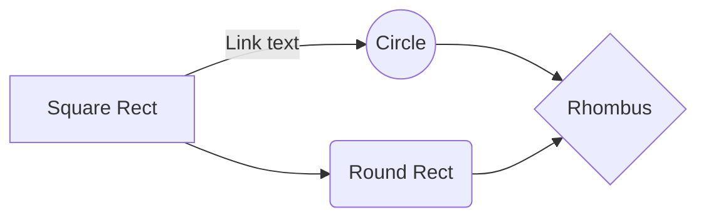

!!! danger

    Most of these entries are only compatible with <abbr title="GitHub Flavored Markdown">[GFM](https://github.github.com/gfm/)</abbr>.  
    [:material-github: View on GitHub](https://github.com/SimonMarquis/TIL/blob/main/docs/markdown.md)

### Blockquote highlight

!!! danger "[:material-github: View on GitHub](https://github.com/SimonMarquis/TIL/blob/main/docs/markdown.md#blockquote-highlight)"

> [!NOTE]  
> Highlights information that users should take into account, even when skimming.

> [!TIP]
> Optional information to help a user be more successful.

> [!IMPORTANT]  
> Crucial information necessary for users to succeed.

> [!WARNING]  
> Critical content demanding immediate user attention due to potential risks.

> [!CAUTION]
> Negative potential consequences of an action.

The initial syntax used on GitHub was:

- Single line

  > **Note** This is a single line note

  > **Warning** This is a single line warning

- Multiline

  > **Note**  
  > This is a
  > multiline note

  > **Warning**  
  > This is a
  > multiline warning

[🔗](https://github.com/community/community/discussions/16925)

### Color models

!!! quote "In issues, pull requests, and discussions, you can call out colors within a sentence by using backticks."

| Color | Syntax | Example | Output |
|---|---|---:|---:|
| HEX | `#RRGGBB` | `#0055A4` | <code class="notranslate">#0055A4<span class="ml-1 d-inline-block border circle color-border-subtle" style="background-color: #0055A4; height: 8px; width: 8px;"></span></code> |
| RGB | `rgb(R,G,B)` | `rgb(255, 255, 255)` | <code class="notranslate">rgb(255, 255, 255)<span class="ml-1 d-inline-block border circle color-border-subtle" style="background-color: rgb(255, 255, 255); height: 8px; width: 8px;"></span></code> |
| HSL | `hsl(H,S,L)` | `hsl(4, 85%, 57%)` | <code class="notranslate">hsl(4, 85%, 57%)<span class="ml-1 d-inline-block border circle color-border-subtle" style="background-color: hsl(4, 85%, 57%); height: 8px; width: 8px;"></span></code> |

[🔗](https://docs.github.com/en/get-started/writing-on-github/getting-started-with-writing-and-formatting-on-github/basic-writing-and-formatting-syntax#supported-color-models)

### Details summary

Toggle with the `open` attribute in the `<details>` tag.

<details open>
    <summary>Details</summary>

```html
<details open>
    <summary>Details</summary>
    Something small enough to escape casual notice.
</details>
```
</details>

### Diff

```diff
- Hello, World!
+ Hello, Simon!
```

### Footnotes

!!! danger "[:material-github: View on GitHub](https://github.com/SimonMarquis/TIL/blob/main/docs/markdown.md#footnotes)"

Here is a simple footnote[^1].

[^1]: My reference.

[🔗](https://github.blog/changelog/2021-09-30-footnotes-now-supported-in-markdown-fields/)

### GeoJSON

!!! danger "[:material-github: View on GitHub](https://github.com/SimonMarquis/TIL/blob/main/docs/markdown.md#geojson)"

[Specs](https://geojson.org/) & [Viewer](https://geojson.io/)

```geojson
{
    "type": "FeatureCollection",
    "features": [
        {
            "type": "Feature",
            "properties": {
                "label": "Paris"
            },
            "geometry": {
                "type": "Point",
                "coordinates": [
                    2.3522,
                    48.8566
                ]
            }
        },
        {
            "type": "Feature",
            "properties": {
                "label": "France"
            },
            "geometry": {
                "type": "Polygon",
                "coordinates": [
                    [
                        [
                            -5.225,
                            41.333
                        ],
                        [
                            9.55,
                            41.333
                        ],
                        [
                            9.55,
                            41.333
                        ],
                        [
                            9.55,
                            51.2
                        ],
                        [
                            -5.225,
                            51.2
                        ],
                        [
                            -5.225,
                            41.333
                        ]
                    ]
                ]
            }
        }
    ]
}
```

### GitHub Custom Emojis

!!! danger "[:material-github: View on GitHub](https://github.com/SimonMarquis/TIL/blob/main/docs/markdown.md#github-custom-emojis)"

- :atom: `:atom:`
- :basecamp: `:basecamp:`
- :basecampy: `:basecampy:`
- :bowtie: `:bowtie:`
- :electron: `:electron:`
- :feelsgood: `:feelsgood:`
- :finnadie: `:finnadie:`
- :goberserk: `:goberserk:`
- :godmode: `:godmode:`
- :hurtrealbad: `:hurtrealbad:`
- :neckbeard: `:neckbeard:`
- :octocat: `:octocat:`
- :rage1: `:rage1:`
- :rage2: `:rage2:`
- :rage3: `:rage3:`
- :rage4: `:rage4:`
- :shipit: `:shipit:`
- :suspect: `:suspect:`
- :trollface: `:trollface:`

[🔗](https://github.com/ikatyang/emoji-cheat-sheet/blob/master/README.md#github-custom-emoji)

### Image with reference link

```md
[![alt text][image]][hyperlink]

[hyperlink]: https://…
[image]: https://… "tooltip"
```

### Keyboard

<kbd>Ctrl</kbd> + <kbd>Alt</kbd> + <kbd>Suppr</kbd>

### Maths

!!! danger "[:material-github: View on GitHub](https://github.com/SimonMarquis/TIL/blob/main/docs/markdown.md#maths)"

This sentence uses `$` delimiters to show math inline:  $\sqrt{3x-1}+(1+x)^2$

**The Cauchy-Schwarz Inequality**

$$\left( \sum_{k=1}^n a_k b_k \right)^2 \leq \left( \sum_{k=1}^n a_k^2 \right) \left( \sum_{k=1}^n b_k^2 \right)$$

```math
\left( \sum_{k=1}^n a_k b_k \right)^2 \leq \left( \sum_{k=1}^n a_k^2 \right) \left( \sum_{k=1}^n b_k^2 \right)
```

[🔗](https://github.blog/changelog/2022-06-28-fenced-block-syntax-for-mathematical-expressions/)

### Mermaid



### Mermaid info

```mermaid
info
```

### Prefers color scheme

<picture>
  <source width="150em" media="(prefers-color-scheme: dark)" srcset="https://user-images.githubusercontent.com/25423296/163456776-7f95b81a-f1ed-45f7-b7ab-8fa810d529fa.png">
  
</picture>

```html
<picture>
  <source media="(prefers-color-scheme: dark)" srcset="https://user-images.githubusercontent.com/25423296/163456776-7f95b81a-f1ed-45f7-b7ab-8fa810d529fa.png">
  
</picture>
```

[🔗](https://github.blog/changelog/2022-05-19-specify-theme-context-for-images-in-markdown-beta/)

### Reference labels

!!! danger "[:material-github: View on GitHub](https://github.com/SimonMarquis/TIL/blob/main/docs/markdown.md#reference-labels)"

https://github.com/SimonMarquis/TIL/labels/bug • https://github.com/SimonMarquis/TIL/labels/enhancement • https://github.com/SimonMarquis/TIL/labels/good%20first%20issue • https://github.com/SimonMarquis/TIL/labels/help%20wanted • https://github.com/SimonMarquis/TIL/labels/invalid • https://github.com/SimonMarquis/TIL/labels/question • https://github.com/SimonMarquis/TIL/labels/wontfix

[🔗](https://github.blog/changelog/2022-02-03-reference-labels-in-markdown/)

### Table alignment

| Left | Center | Right |
|:-----|:------:|------:|
| ⬤ | ⬤ | ⬤ |

```markdown
| Left | Center | Right |
|:-----|:------:|------:|
| ⬤ | ⬤ | ⬤ |
```

### Theme context for images

!!! danger "[:material-github: View on GitHub](https://github.com/SimonMarquis/TIL/blob/main/docs/markdown.md#theme-context-for-images)"


```markdown

```

[🔗](https://github.blog/changelog/2021-11-24-specify-theme-context-for-images-in-markdown/)
